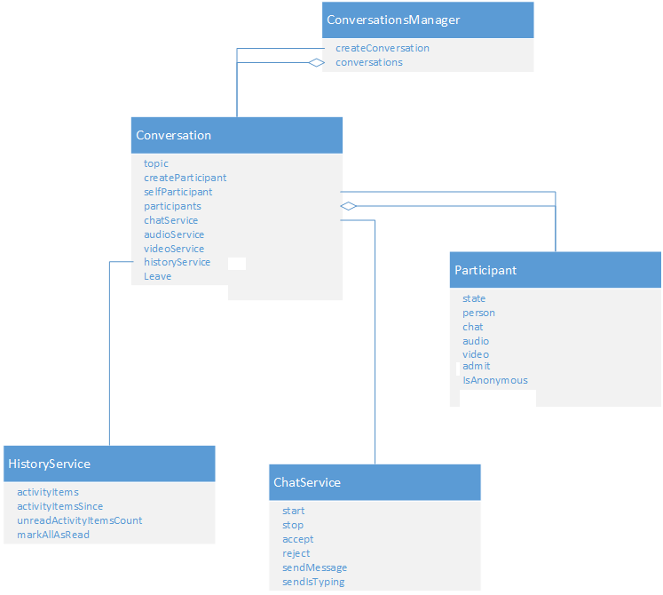

# Conversations

 **Last modified:** March 28, 2016

 _**Applies to:** Skype for Business 2015_

## Conversations

The Skype Web SDK provides the following objects to start or join IM messaging, and to send and receive messages in a conversation.

- Use a [ConversationsManager](https://msdn.microsoft.com/en-us/library/office/dn962151(v=office.16).aspx) object to start an outgoing conversation. For incoming invitations, the accept and reject actions are taken on the incoming [Conversation](https://msdn.microsoft.com/en-us/library/office/dn962132(v=office.16).aspx) object.
    
- Use a [Conversation](https://msdn.microsoft.com/en-us/library/office/dn962132(v=office.16).aspx) object to exchange messages, send and receive audio-visual content, and share applications in the conversation.
    
- Use the [Skype Web Conversation Control](UseConversationControl.md) to host an IM conversation in your webpage. The **Conversation Control** encapsulates the model, view, and view model so that you only write code to host and render the control itself. Use the control when you want to let the Skype Web SDK provide the chat UI. If you use the conversation control, your webpage can host a complete IM dialog with as few as three Skype Web SDK API calls.
    
A conversation is a logical container for communication between two or more persons. The properties of a conversation include  **selfParticipant**, **participants**, **historyService** in the conversation, and conversation services in use. Each of these objects is represented in Figure 1, and the relationship between conversation objects is represented by connectors in the figure. You can add participants to a conversation before it starts or at any time after starting. Adding participants to a 1-on-1 conversation will escalate that conversation to a multiparty meeting.

**Figure 1. The relationship between objects in the Skype Web SDK conversation model**

### Conversation types

A conversation can be thought of as two-dimensional, with the number of conversation services representing one dimension, and the number of participants representing the other.

- Single modal and multi-modal conversation: A single modal conversation is an Instant Message (IM) or an audio conversation, which is actually audio/video. A multi-modal conversation uses two media modalities: IM and audio/video.
    
- Two-party conversation: A two-party conversation is a peer-to-peer conversation. A multi-party conversation is escalated to a meeting when the third-party joins the conversation.
    

### Conversation services

Several conversation service types are supported by the SDK:

- [ChatService](https://msdn.microsoft.com/en-us/library/office/dn962148(v=office.16).aspx)  
    
- [AudioService](https://msdn.microsoft.com/en-us/library/office/mt219384(v=office.16).aspx)  
    
- [VideoService](https://msdn.microsoft.com/en-us/library/office/mt219389(v=office.16).aspx)  
    
- [HistoryService](https://msdn.microsoft.com/en-us/library/office/dn962130(v=office.16).aspx)  

    
**Supported clients**
    
Internet Explorer 10 and later, Safari 8 and later, FireFox 40 and later, and Chrome 43 and later.

## Additional resources

- [Start a conversation](StartConversation.md)
- [Respond to a conversation invitation](RespondToInvitation.md)
- [Add participants to a conversation](AddParticipants.md)
- [Use the Skype Web Conversation Control in a webpage](UseConversationControl.md)
