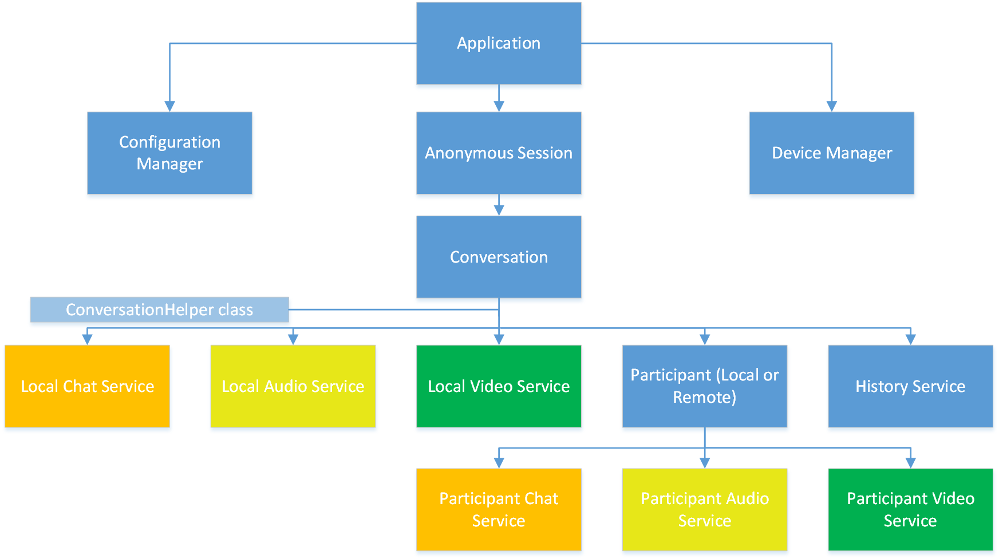

# Skype for Business App SDK - API overview
## SDK Object Model 	
 
Figure 1 provides an overview of the object model hierarchy of the Skype for Business App SDK. A brief description of the objects follows.  Detailed descriptions of the operations provided by each object are available in the Deep Dive section.
  

Figure 1. The Skype for Business App SDK object model hierarchy

### Application

The **Application** object is a root entity that provides access to all other entities and services in the SDK. Developers are expected to initialize the application before using other entities in the SDK. It provides access to the **ConversationsManager** object.

### Conversation

The **Conversation** object represents a communication between one or more participants and is controlled by a set of “services”.

* Participant child objects can be added and removed.   Events are available that indicate when, for example, a new participant has joined the conversation.
* The service child objects are fixed and cannot be added or removed; there is one for each aspect to the communication.
* A ConversationHelper class. The SDK comes with a conversation helper class that handles some of the details of managing a conversation. Use the helper class if you want to support the core meeting scenarios with a minimum of code.  

#### Service

Each service object is of a different type, and provides management of a specific aspect of the conversation, for example, management of chat message sending or its activity history: 
 
* **Chat**  To send an IM, to send message that the participant is typing, and so on.
* **Audio** To start/stop audio in the conversation, to control local audio devices etc.
* **Video** To start/stop video in the conversation, to control local video devices etc.
* **History** To view and manage the previous events (for example, sent messages) for the conversation. 

Events are available that indicate that a new message has arrived or the audio/video state has changed.

#### Participant

The **Participant** object represents a specific participant in the conversation.  (A conversation may have many participants.)   This object provides access to the participant’s attributes (for example, name) and to the chat, audio, and video sub-services that are specific to that participant.

Events are available that indicate when, for example, the participant starts typing or their audio/video state has changed.

There is a participant object for the local (or "self") participant.  To achieve some operations, both the chat, audio and video sub-services for this specific local participant must be used alongside the local device services described above.  See the API reference documentation for further details on how this works for each operation.  

### DevicesManager

The **DevicesManager** object provides access to configuration of multimedia devices used in audio and video calls. It provides lists of available devices of each type (speakers, microphones, cameras) and allows selection of which one should be used.  Devices and their attributes may vary between platforms. 

## Additional Resources
* [How to join a Skype for Business meeting anonymously](HowToJoinMeeting.md)