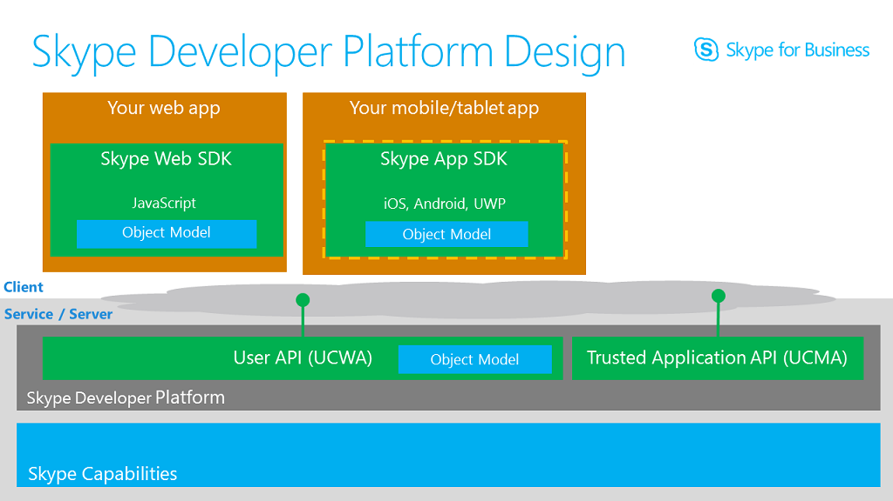
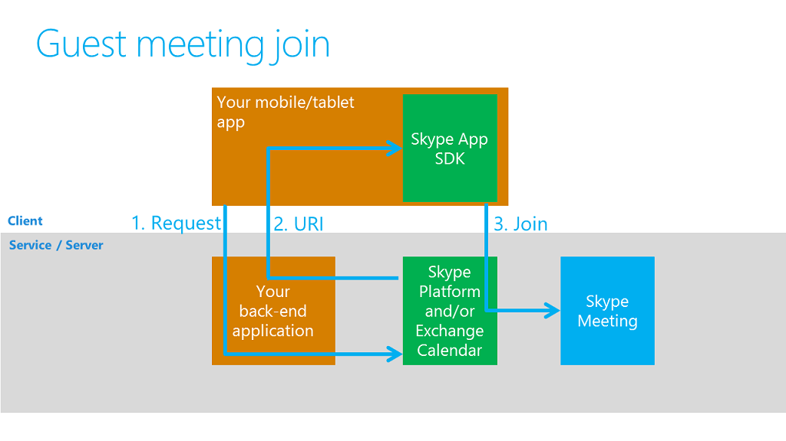

# Embed Skype business-to-consumer communications in your mobile app

## Overview

The Skype for Business App SDK provides a platform to businesses to enable communication scenarios within their applications. The SDK offers capabilities to seamlessly integrate messaging, audio, and video experiences. 
 

Figure 1. Sample client application integration with Skype for Business App SDK

The initial focus of the SDK is to enable businesses to create consumer-facing iOS and Android applications that include IM, audio and video communication capabilities from consumers (external users with no Skype for Business account) to business users (internal Skype for Business-enabled users within the business).  The SDK makes it possible for these Skype for Business communications to occur from within the business application, alongside your own business-specific data or tasks.  

This article outlines the relevant **architectural concepts** and the **API** surface of the SDK to help developers (product managers, designers, and engineers) conceptualize the integration of the Skype for Business App SDK with their applications and also design their workflows. 

### Platforms

The SDK will be available for the iOS and Android platforms and will include a platform-specific Objective-C and Java interfaces, respectively.  The precise details of the interfaces will be communicated later.  For now, this document focuses on the SDK concepts and call-flows in a platform-neutral way. 

### Business to Consumer (B2C) scenarios

The consumer endpoint will be the application with the integrated Skype for Business App SDK.  The business endpoint is a Skype for Business-capable user/employee of the business.  The SDK will allow Consumer to Business communication either via a Skype for Business meeting or direct 1:1 Skype for Business conversation to a service endpoint.

#### Communication via a Skype for Business meeting

In this scenario, the application will use the SDK to connect to a Skype for Business meeting.  Because the consumer using the application will not have Skype for Business credentials, the SDK will support joining the Skype for Business meetings as a _guest_. 
 
This call-flow is often referred to as Anonymous Meeting Join.  Meetings are identified by a meeting URL, such as: [https://join.contoso.com/meet/john/BW9Z1MJD]( https://join.contoso.com/meet/john/BW9Z1MJD).  The client app will need to obtain this URL from its own back-end services (which in turn, may obtain it using the Skype for Business server-side APIs).  

> **Note**: The scheduled meeting needs to explicitly allow anonymous users in the meeting.

This workflow for anonymous meeting join is available today via the Skype for Business (Lync) mobile applications.  You can experiment with it by creating a Skype for Business  meeting in Outlook or the Skype for Business desktop client and then launching the URL while on your phone.  

In future, this scenario may require the back-end services to also obtain an access token and pass it to the client app, along with the meeting URL.

Figure 2. Anonymous meeting join

##### Anonymous meeting join work items
 
1. Write a back-end application to handle client “visits”:
   * Receive a request from a client app, _initially via your own back channel_.
   * Verify the visitor.
2. Use back-end app to get a meeting URL:
   * Such as https://join.contoso.com/meet/john/BW9Z1MJD
   * Via calendar metadata or via our APIs (User API / UCWA)
   * Prescheduled (manually) or on-demand
   * Pass the URL (and token) up to your client app and into the App SDK
3. App SDK joins the meeting.
 

## Enabling a simple anonymous meeting join code pattern 

The initial public preview of the SDK supports anonymous meeting join by providing a simple API that you use to join a meeting using chat and video. The API exposes a conversation object with a single method to join a meeting and methods for preparing video, starting video, and muting audio. You can learn more about simplified meeting join in [Getting Started with the App SDK](GettingStarted.md). If you want more control over an anonymous meeting, you can use the object model described in the following section.

## SDK Object Model 	
 
Figure 4 provides an overview of the object model hierarchy of the Skype for Business App SDK. A brief description of the objects follows.  Detailed descriptions of the operations provided by each object are available in the Deep Dive section.
  

Figure 4. The Skype for Business App SDK object model hierarchy

### Application

The **Application** object is a root entity that provides access to all other entities and services in the SDK. Developers are expected to initialize the application before using other entities in the SDK. It provides access to the **ConversationsManager** object.

### ConversationsManager

The **ConversationsManager** object provides functionality to start a new conversation and manage current conversations.  In the early stages, where the focus is on scenarios where the app user is a consumer without Skype for Business credentials, the SDK will only support a single active conversation at a time. 

### Conversation

The **Conversation** object represents a communication between one or more participants and is controlled by a set of “services”.

* Participant child objects can be added and removed.   Events are available that indicate when, for example, a new participant has joined the conversation.
* The service child objects are fixed and cannot be added or removed; there is one for each aspect to the communication.

#### Service

Each service object is of a different type, and provides management of a specific aspect of the conversation, for example, management of chat message sending or its activity history: 
 
* **Chat**  To send an IM, to send message that the participant is typing, and so on.
* **Audio** To start/stop audio in the conversation, to control local audio devices etc.
* **Video** To start/stop video in the conversation, to control local video devices etc.
* **History** To view and manage the previous events (for example, sent messages) for the conversation. 

Events are available that indicate that a new message has arrived or the audio/video state has changed.

#### Participant

The **Participant** object represents a specific participant in the conversation.  (A conversation may have many participants.)   This object provides access to the participant’s attributes (for example, name) and to the chat, audio, and video services that are specific to that participant.

Events are available that indicate when, for example, the participant starts typing or their audio/video state has changed.

### DevicesManager

The **DevicesManager** object provides access to configuration of multimedia devices used in audio and video calls. It provides lists of available devices of each type (speakers, microphones, cameras) and allows selection of which one should be used.  Devices and their attributes may vary between platforms. 

 
 
## Versioning and staying up to date

The capabilities of the public preview of the App SDK are limited to anonymous meeting join with audio/video and chat. Once generally available, we anticipate that the SDK will be updated frequently with new capabilities.

* We’ll make every effort to ensure API back-compatibility with previous versions.  We will communicate any breaking changes clearly.
* To allow the SDK to move forward quickly, our guidance will be to update to the latest SDK at least every six months.  Where an app is based on an older version of the SDK, it may need to be updated so that:
  * We can investigate an issue report
  * It continues to work against Skype for Business Online or the latest Skype for Business Server CU; such occurrences should be rare and will be communicated with good notice.
* Fixes to bugs will typically be delivered only in new versions of the SDK and not back-ported to previous versions. 

## Licensing

The SDK can be used to participate in conversations where at least one of the participants is a licensed user of Skype for Business.
