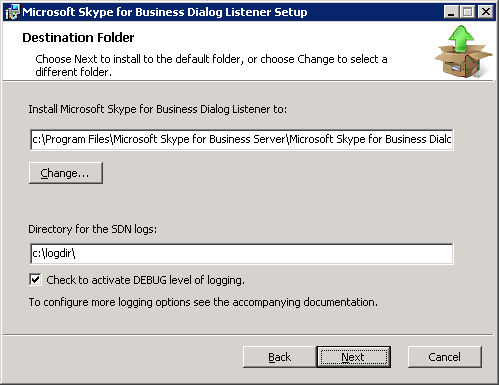
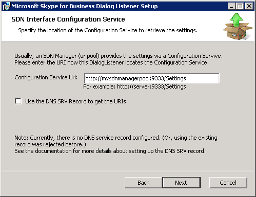
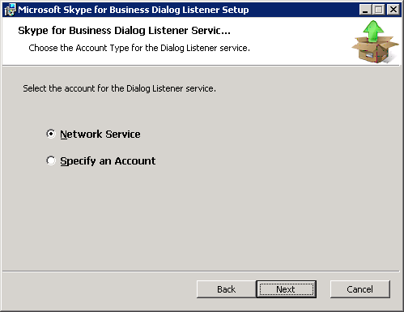

# Installing the Dialog Listener

  
    
    

 **Applies to**: Lync Server 2013 | Skype for Business 2015

Follow these steps to use the **Setup Wizard** to install the Dialog Listener component.
  
    
    

> [!IMPORTANT]
> It is recommended that you first install the SDN Manager, and then install the Dialog Listener. 
  
    
    
> [!WARNING]
> Installing a DialogListener for a second FE pool removes the application registration in the CMS for the first pool. Subsequent pool DialogListener installations **MUST** a) utilize manual installation with the **SKIPREGISTRATION=1** option, b) manually create the **CsServerApplication** for the second FE pool, and c) restart the DialogListener service.

## To install the Dialog Listener

1. Copy the SkypeForBusinessDialogListener.msi file to each Skype for Business Server front end and run the installation package on each server computer by following these steps for each. 
    
  
2. Choose the SkypeForBusinessDialogListener.msi. In the **Welcome to the Microsoft Dialog Listener Setup Wizard**, then choose **Next**.
    
  
3. Accept the End-User License Agreement, and then choose **Next**.
    
  
4. Specify the installation folder and also specify the location of the application logs (see Figure 1). In the destination folder field, keep the default or enter a custom Dialog Listener installation directory. Do the same for the service logging directory and select the checkbox to activate debug level logging. 
    
   **Figure 1. Destination folder selection wizard page**

  

  
  

    
   > [!NOTE]
   > While the number of log files is limited, for production environments it is not recommended that you activate debug logging unless investigating a particular issue, as extensive amounts of logs are written. 

   The installer will attempt to locate a DNS SRV record referring to an SDN configuration service pool and let you choose this SRV record to connect to the configuration service. If you use this option, you will be prompted to specify a client certificate and an account under which the Dialog Listener Windows Service should run before continuing the installation.
    
  
5. In **SDN Interface Configuration Service** wizard page, enter SDN configuration service URL, and then choose **Next**.
    
   **Figure 2. SDN Interface configuration service wizard page**

  

  
  

The configuration service is part of SDN Manager. You may dedicate a particular SDN Manager to serve as the configuration service, or refer to an entire pool of SDN Manager instances by using their pool fully qualified domain name. The data store used by this SDN Manager or pool defines the settings used by this SDN Interface system, including the settings used for all Dialog Listener instances, the SDN Manager itself, and settings for all subscribers. 
    
If you have a DNS SRV record configured, selecting the checkbox ( **Use the DNS SRV Record to get the URIs**) will use the DNS records instead of the URL to locate the configuration service. On the next screen, you may optionally select a client certificate for authentication when using a https connection. 
    
  
6. In **Dialog Listener Service Account** wizard screen, select the **Network Service** or **Specify an Account** option, and then select **Next**.
    
   **Figure 3. Dialog Listener service account**

  

  
  

This wizard screen allows you to specify a user account to run the Dialog Listener Windows Service or, alternatively, use the network service. If the Dialog Listener service fails to start using network service, you may need to change the Windows service definition and specify different credentials. The network service or the specified user account must be in the  *RTC Server Applications*  or *RTC Local Administrators*  local group.
    
  
7. In the **Ready to install** panel, choose the **Install** button to start the installation.
    
  
8. In the wizard completed panel, choose **Finish** to exit the installation wizard.
    
  

## See also

-  [Installing the SDN Manager](installing-the-sdn-manager.md) 
-  [Skype for Business SDN Interface Schema Reference](skype-for-business-sdn-interface-schema-reference.md)
    
  

