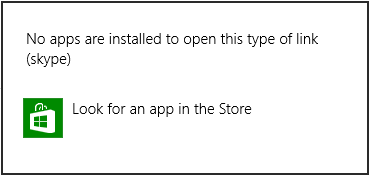
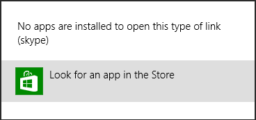

# Skype URI tutorial: Email

Learn how to incorporate Skype communication functionality into your emails.

 _**Applies to:** Skype_

## Use Skype URIs in emails

You can embed Skype URIs as hyperlinks in your email messages and/or signature blocks as convenient ways for people to contact you by using Skype.

However, keep the following in mind:

* Simply pasting a Skype URI does not always convert it to a hyperlink—you typically have to insert it explicitly as a hyperlink.
* Clicking the link might cause a security warning dialog to appear, which might be disconcerting to the user.
* Links might be rendered as plain text, depending on the capabilities of the email applications and/or the receiving user's preferences.

## If you can't click a Skype URI in your emails

Not all email applications or readers support Skype URIs (or hyperlinks in general) in the same manner. For someone 
receiving an email containing a Skype URI, such as in a signature block, the rendering email application might do any of the following:

* Block the hyperlink's action, typically causing a security warning dialog to appear.
* Fail to recognize the  **skype:** scheme as being a valid hyperlink and render it as plain text (but possibly styling it in the link color).
* Strip the hyperlink based on preference settings, and render it as plain text.

## Determine whether a Skype client is installed

Microsoft email applications running on Windows 8, such as Outlook and Mail, detect that no application is associated 
with the  **skype:** scheme, and alert the user. Other email applications behave differently.

**Figure 2. Windows Store dialog box**

Keep in mind that detecting the presence of the Skype client is only important if the email application supports Skype URIs.

## What to do if a Skype client is not installed

Microsoft email applications running on Windows 8, such as Outlook, include a link to the Store as part of its alert 
whenever they detect that there is no application associated with the  **skype:** scheme. Simply click the Store icon 
to navigate to the Skype client's entry.

**Figure 3. Windows Store dialog box**

## See also

* [Skype URIs](SkypeURIs.md)
* [Skype URI API reference](SkypeURIAPIReference.md)
* [Skype URIs: Branding guidelines](SkypeURIs_BrandingGuidelines.md)
* [Skype URIs: FAQs](SkypeURIs_FAQs.md)
* [Skype URI tutorial: Windows 8 apps](SkypeURITutorial_Windows8Apps.md)
* [Skype URI tutorial: Webpages](SkypeURItutorial_Webpages.md)
* [Skype URI tutorial: Android apps](SkypeURITutorial_AndroidApps.md)
* [Skype URI tutorial: iOS apps](SkypeURITutorial_iOSApps.md)

