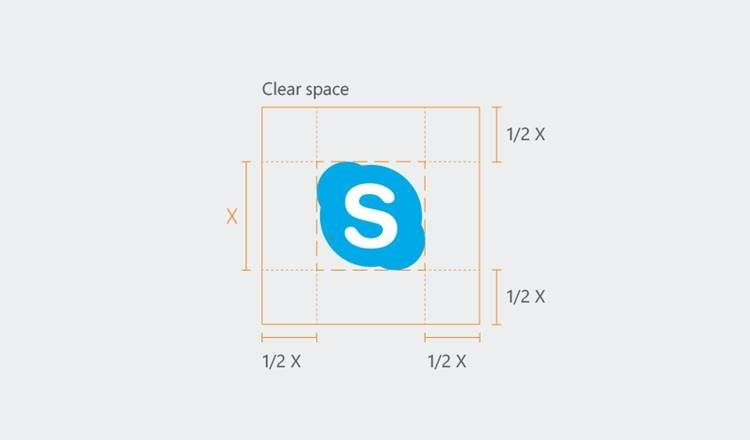
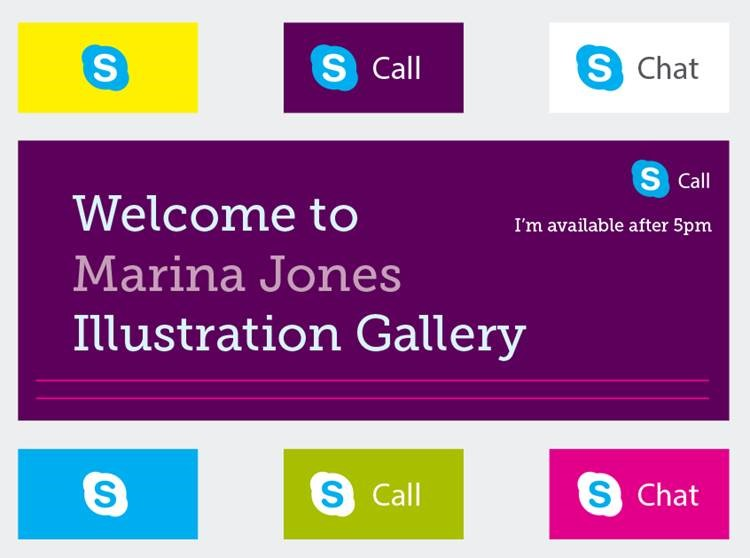
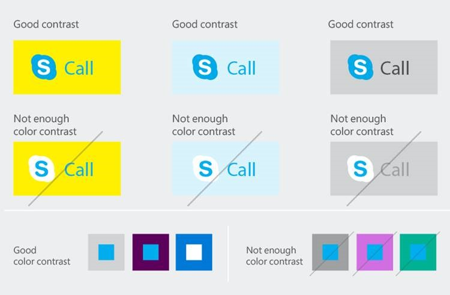

# Skype URIs: Branding guidelines

Learn how to properly and effectively incorporate Skype branding elements into your applications.

 _**Applies to:** Skype_

Your use of the Skype logo, name, and other brand elements in your app's design, appearance, and marketing materials are detailed in and governed by the [Skype Brand Guidelines](http://www.skype.com/go/brand-guidelines/). As a general rule, third parties  _may not_ use the Skype Brand Elements unless they have either received prior written permission, or the proposed use falls within certain limited exceptions.

In particular, your app or webpage:

* Must not incorporate any of the Skype Brand Elements, or variations thereof, into your own product names, service names, trademarks, logos, company names, domain names, meta tags, adwords, keywords, search terms, and so forth.
* Must ensure sufficient space around the Skype Brand Elements so they appear clean and uncluttered.
* Must ensure placement of the Skype Brand Elements on an appropriate background.

## Matching brand elements with actions

Your app or webpage must use the appropriate brand element for the Skype URI action being initiated.

**Table 1. Image to use for Skype button**

|**Button**|**Image**|
|:-----|:-----|
|Shift Focus||
|Audio or Video Call||
|Chat||
|Choose: Call or Chat||

## Size and spacing requirements

You must keep sufficient space around the Skype Brand Elements so they appear clean and uncluttered, particularly if the Skype URI is associated with another logo or text string.

Specifically, this means maintaining 100% spacing or 16 pixels, whichever is larger. For example, if you are using a 24 pixel brand element, you must maintain a 24 pixel margin around that brand element. Similarly, if you are using a 10 pixel brand element, you must maintain a 16 pixel margin around that brand element.

**Figure 1. Branding elements with appropriate pixel margins**

## Background requirements

You must ensure that the Skype Brand Elements appear on a complimentary background.

Skype URI-specific brand elements are available in two colors:

* Skype Blue (preferred)
* White

You should use an element's white variant only when your background conflicts with the element's Skype Blue variant.

**Figure 2. Skype logo on complimentary colored backgrounds**

You must ensure that the Skype Brand Elements appears on an appropriately contrasted background. Do not place the Skype logo over busy areas of photographs. The logo should always be legible.

**Figure 3. Skype logo on contrasted backgrounds**

## Downloading the Skype Brand Elements

For webpages, the [Skype.ui JavaScript function](0a73cb5e-b655-449c-add2-e87b14dfd832.md#skypeui) incorporates and accesses the Skype URI-specific brand elements dynamically when the webpage is rendered. While the function ensures sufficient space around the Skype Brand Element, it cannot ensure placement on an appropriate background.

For Windows 8, Android, and iOS applications, you can [download](http://www.microsoft.com/download/details.aspx?id=43127) the Skype URI-specific brand elements from the Skype Developer website, and incorporate them as application resources.

The brand elements are available as PNG files in the following pixel sizes: 10, 12, 14, 16, 24, 32, 48, 64, and 80. Color choices are Skype Blue and white, both on transparent backgrounds.

## How not to use the Skype Brand Elements

The Skype action must always be kept clear and uncluttered as a standalone capability. Along these lines, here are some examples of how not to use the Skype URI-specific brand elements.

### Backgrounds

Do not place the Skype Brand Elements on a non-complimentary background.

For example, do not use an element's Skype Blue variant on a blue or similarly hued background. In addition, do not use an element's white variant on a light-colored background, or on one that compliments the element's Skype Blue variant.

**Figure 4. Skype icon placed on non-complimentary backgrounds**

### Clear space

Do not place the Skype Brand Elements next to other design elements, such as text, within the clear space area (100% of the size of the Skype Brand Element or 16 pixels, whichever is larger).

**Figure 5. Skype logo with text placed within clear space area**

### Borders and lines

Do not add borders or lines to the Skype Brand Elements, or place them in an inappropriate place on a photo or other artwork.

**Figure 6. Skype logo with added border**

**Figure 7. Skype logo placed over photograph**

### Alterations

Do not alter the Skype Brand Elements in any way. 

**Table 2. Skype Brand Element alterations to avoid**

|**Alteration**|**Example**|
|:-----|:-----|
|Alter the position of the Skype Brand Element components, creating your own configurations.||
|Alter the text element by using italics, changing the proportions, or changing the skew.||
|Add special characters, symbols, or graphic elements.||
|Add effects, such as drop shadows.||
|Rename the Skype action.||

## Additional resources

* [Skype URIs](10f120df-50b8-4942-a8e4-636bbf6d7744.md)
* [Skype URI API reference](aeddfd97-e83b-462b-a27c-2512bd7f5c4d.md)
* [Skype URIs: Branding guidelines](a4e772c7-39b1-45b6-b55f-9c9a166cc51b.md)
* [Skype URIs: FAQs](368672ef-de32-42fa-a743-ed436f9ef638.md)
* [Skype URI tutorial: Windows 8 apps](14adc687-a0dc-4bfe-85a6-edc754c728ce.md)
* [Skype URI tutorial: Email](304c9d0c-486d-4307-8a8d-8d92bd9a6ec1.md)
* [Skype URI tutorial: Webpages](0a73cb5e-b655-449c-add2-e87b14dfd832.md)
* [Skype URI tutorial: Android apps](e7ff59ec-22ec-42ae-98ef-2a370aa212f1.md)
* [Skype URI tutorial: iOS apps](b3e1e690-039f-4112-accb-9481794266d0.md)
* [Skype URI-specific brand elements](https://developer.skype.com/resources/skype-button-assets.zip)

