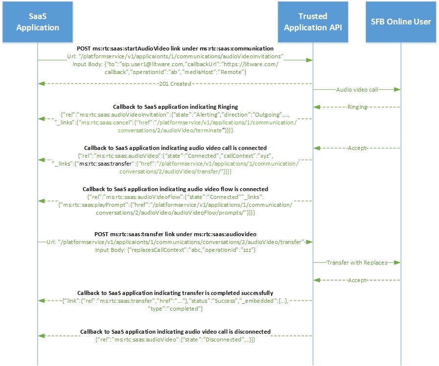

# Trusted Application API PSTN communication

Trusted Application (UCAP) API public switched telephone network (PSTN) lets you to establish audio/video communication between a service application (SA) endpoint and remote participant. UCAP API supports both incoming (to the SA endpoint) and outgoing audio video calls from the SA endpoint to the user. 

## Prerequisites:
 - Please make sure that you have completed all the registration process as described in
   [Developing Trusted Application API applications for Skype for Business Online](./DevelopingApplicationsforSFBOnline.md). Also, do not forget to set up the PSTN trusted 
   application endpoint as described in [Trusted application endpoint](./TrustedApplicationEndpoint.md). 
   
   In ['Registering your application in Azure AD'](./RegistrationInAzureActiveDirectory.md) section, please make sure that the following application permissions are selected for **PSTN call flow:** 
    - Send/Receive PSTN (preview) 
    - Send/Receive Audio and Video (preview)
    
    >Note: For this release, UCAP only supports incoming audio video call to the SA endpoint's registered PSTN number.

  
 ## Communication via UCAP PSTN (Audio/Video) 

You should be familiar with the following concepts before adding PSTN capability to your service application. 

### Interactive voice response support
UCAP supports interactive voice response (IVR) capability, where the service application never directly interacts with the media. UCAP allocates a media bot remotely on behalf of the service application and allows the application to interact with the remote participant through functions exposed by UCAP, for example, It can play a prompt or recognize DTMF tone input via keypad.

### Audio/Video call requirements

- A registered PSTN trusted application endpoint. 
 
- A service phone number. To receive incoming calls from the PSTN, the tenant administrator must acquire a service phone number and assign it to the service application's endpoint.
 Please refer [Registration in SFB Online](./SfBRegistration.md) for more details.
 
    > **Note:** For the outgoing audio video call, the call target has to be a SfB user within the same tenant of the service application endpoint.

- For interactive voice response (IVR) calls, insert the **mediaHost** header in HTTP requests that initiate audio calls or accept incoming audio calls.  outbound call. The value of the header is "Remote" in the HTTP input body.

### PSTN UCAP operational capabilities

The six UCAP resources described in this section give your app access to the A/V flow of a call.

- **ms:rtc:saas:audiovideo** resource implements the signaling connection with the remote participant for the audio video call. 

- **ms:rtc:saas:audioVideoFlow** encapsulates the actual audio and video media of the call. It is exchanged on an instance of this resource. The resource is created at the time call is established.

- **ms:rtc:startAudioVideo**  allows the application to create a new conversation with the specified contact with audio/video modality.

- **ms:rtc:saas:audioVideoFlow** exposes media capabilities
- **ms:rtc:saas:playPrompt** is a pre-recorded prompt which can be played.
- **ms:rtc:saas:tone** is recognized an incoming DTMF or tone events. 

>Note: These operation capabilities are made available to the application only after a successful media negotiation, upon which the state of the flow will be Connected.
 
### Audio video call transfer support

The **ms:rtc:saas:transfer** resource provides the capability to transfer the ongoing audio video call. UCAP supports **Attended Transfer** and **Supervised Transfer**. For more details please refer UCMA documentation: [Transferring a Call (UCMA 4.0 Core SDK)](https://msdn.microsoft.com/en-us/library/dn465979.aspx) .

The application specifies either the **to** input property (the address of the transfer target) or the **replacesCallContext** input property (the call to be replaced because of a transfer) in the transfer request body, to indicate whether this is an attended transfer request or supervised transfer request.
			
		
## Call flow in pseudo code

1. The PSTN caller calls the pre-registered service application (SA) endpoint's phone number.

2. The PSTN call gets routed through the SfB Online to the Trusted Application API and it routes the call event to the pre-registered SA endpoint's callback listener.

3. The SA accepts the call (the SA may also decide to decline the call). 
		
4. The Trusted Application API allocates a media bot for the call, negotiates media and sends success notifications to the SA endpoint's callback listener.

5. The SA receives call and media flow connected events and asks the Trusted Application API to play a pre-recorded prompt on the PSTN call.

6.  For Example, The PSTN caller entered 1 on his keypad.

7. The Trusted Application API sends tone received (value=1) event to SA endpoint's callback.

8. The SA makes an outbound call to a SfB Online user (typically called an agent) through the Trusted Application API.

9. The Trusted Application (UCAP) API sends call and media flow connected events for the agent's call to the SA endpoint's callback.

10. The SA initiates a supervised transfer on the agent's call with the replacement context of the PSTN call. The agent receives the transfer request and will automatically calls the PSTN caller, asking him to replace the call leg with the SA (the original PSTN call from the caller to SA endpoint's phone number)

11. Upon successful transfer, Trusted Application API sends the call termination events on both the agent's call and the PSTN  call to the SA endpoint.
		

### Inbound callflow

### Outbound callflow

			
		
