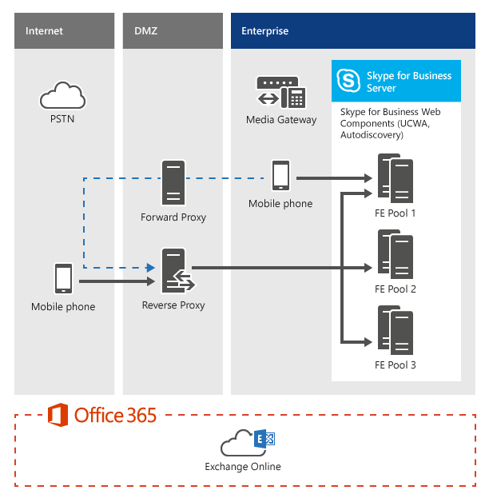
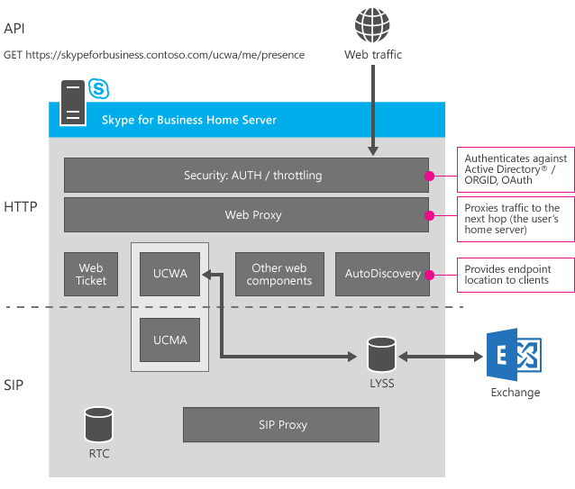

# Architecture
Learn about the architecture as it relates to .

 **Last modified:** April 16, 2015

 _ **Applies to:** Skype for Business 2015_

 provides to enterprises a suite of platforms and solutions to make it easier to connect people for communication and collaboration. A new component of is the service. The API for this service exposes Lync features through the HTTP protocol.

**The UCWA architecture in a Skype for Business Server 2015 deployment**

The illustration shows the architecture in deployment at a high level. Some of the components that are involved are:

-  **UCWA** powers real-time communications for mobile and web clients in . This web component is deployed on all roles as a web component.
    
-  **Autodiscovery** allows a client to detect the web entry point; that is, the home pool/server for a specific user. The client connects to the Discovery service, which provides the FQDN of the user's home server pool. After the user "discovers" the home server, the user can interact with .
    
-  **Mediation server** is used to enable Phone Audio for .
    

## UCWA interaction with

The following illustration shows how fits into the architecture.

**How a UCWA application interacts with Skype for Business Server 2015**

All web traffic flows through the Web Infra layer that is responsible for authentication as well as throttling. This layer is also responsible for proxying traffic to the next hop server; that is, the user's home server. 

After the home server is located, a web application interacts with by using the HTTP protocol. For more information, see [Create an application](CreateAnApplication.md).

