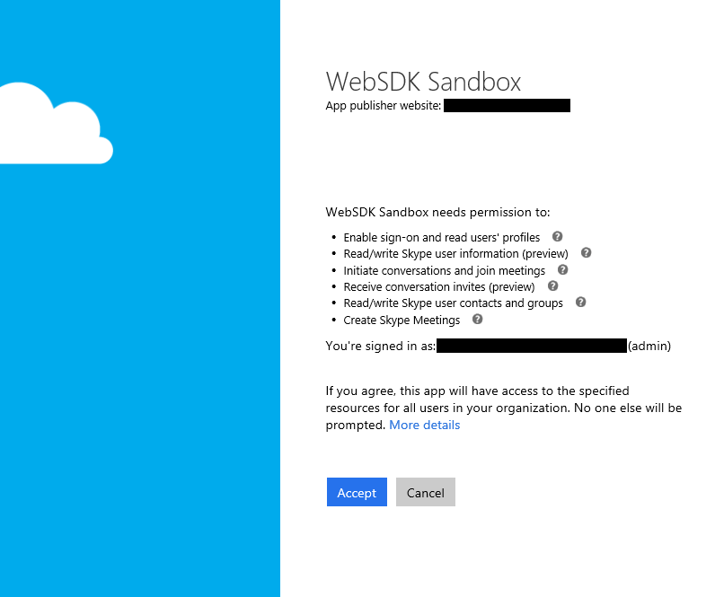

# AAD Auth Failures - Administrator has not provided consent to use SfB Web APIs

_"Calling principal cannot consent due to lack of permissions."_

_**Applies to:** Skype for Business 2015_

**In this article**
- [Who is this article for?](#audience)
- [The Issue](#issue)
- [The Solution](#solution)
- [Forcing the Admin Consent Prompt to Appear](#force-admin-consent)
- [Related Topics](#related-topics)

## Who is this article for?

If you are attempting to use the Azure AD authentication option to sign into the Skype for Business (SfB) Web SDK and you are seeing an AAD error page that looks like the following then this article is for you. The error page should have this message: "Calling principal cannot consent due to lack of permissions."

If this is not your issue, return to [Troubleshooting Azure AD Authentication Failures for Skype Web SDK](./AADAuthFailures.md) for a list of other potential issues.

## The Issue

You are either trying to sign in with a non-administrator account in the tenant where you have registered your application before an administrator has provided consent, or the administrator revoked consent or denied permission for all users in the tenant. 
Alternatively, you may have incorrectly configured the permissions required by your app for accessing the Skype for Business Online API. If the steps in this guide don't work for you or this case describes your error, follow [AAD Auth Failures - Client requesting resource not in requiredResourceAccess list](./AADAuth-DelegatePermissions.md) instead.

## The Solution

When configuring the app through AAD to use the SfB online APIs, you must sign in as a tenant administrator the first time and consent on behalf of all users in the tenant to access the Skype for Business online APIs.

If you have correctly configured the permissions required by your application, the first time you sign in as an administrator you should see a prompt that looks like this:

Note the text at the bottom that reads _"If you agree, this app will have access to the specified resources for **all users in your organization**. No one else will be prompted."_ If you don't see this text, follow the steps below to force the administrator consent prompt to reappear.

### Forcing the Administrator Consent Prompt to Appear

There are a couple ways in which you can delete or deny admin consent for your app to use the SfB online APIs:

1. You deleted the enterprise application by going to **portal.azure.com** > **Azure Active Directory** > **Enterprise Applications** > **\<your-app\>** > **Delete**
2. You denied admin consent when the prompt first appeared by clicking **Cancel** rather than **Accept**

If you previously did either of these things, you need manually force AAD to prompt you to re-consent by navigating to this URL (replacing _YOUR\_CLIENT\_ID_ and _YOUR\_APP\_URL_ with the appropriate values) and signing in with an admin account: 

`https://login.microsoftonline.com/common/oauth2/authorize?response_type=id_token&client_id=YOUR_CLIENT_ID&redirect_uri=YOUR_APP_URL&response_mode=form_post&resource=https://webdir.online.lync.com&prompt=admin_consent`

If you navigated to this URL, after successfully signing in with an administrator account for your tenant you should see an administrator consent prompt like the one shown above.

If none of the above works, you may have configured the permissions for your application incorrectly. Follow [AAD Auth Failures - Client requesting resource not in requiredResourceAccess list](./AADAuth-DelegatePermissions.md) for step-by-step instructions on how to specify permissions and what permissions to specify your app needs to access the Skype Web SDK APIs. In particular, ensure that you have checked _all_ of the **Delegated permissions** and _none_ of the **Application permissions** for the Skype for Business Online API.

---

## Related Topics

- [Assigning Administrator roles in Azure Active Directory](https://docs.microsoft.com/en-us/azure/active-directory/active-directory-assign-admin-roles)
- [AAD Auth Failures - Client requesting resource not in requiredResourceAccess list](./AADAuth-DelegatePermissions.md)
- [Troubleshooting AAD Auth Failures for Skype Web SDK](./AADAuthFailures.md)
- [Integrating Applications with Azure Active Directory](https://docs.microsoft.com/en-us/azure/active-directory/active-directory-integrating-applications)

