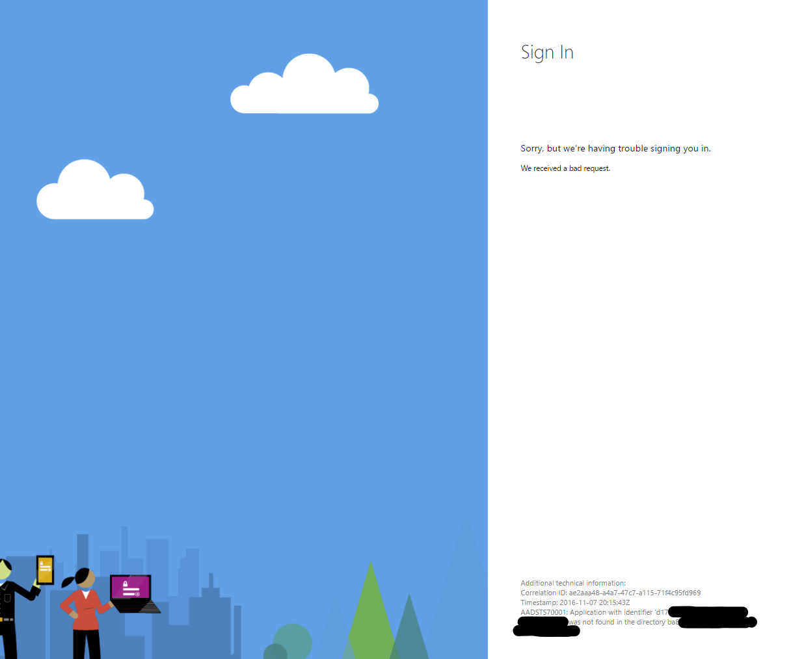
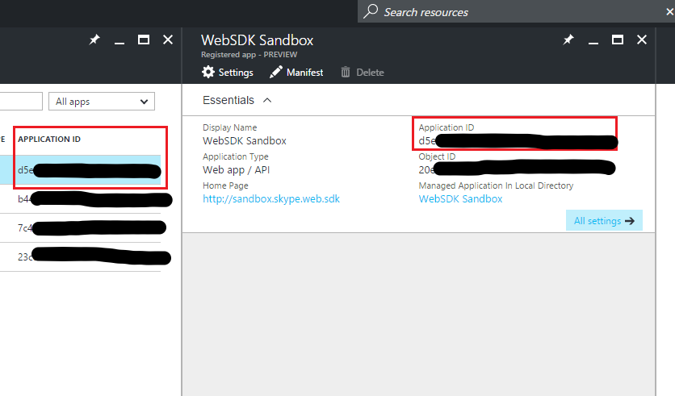

# AAD Auth Failures - Application with identifier <...> was not found in the directory <...>

_**Applies to:** Skype for Business 2015_

**In this article**
- [Who is this article for?](#audience)
- [The Issue](#issue)
- [The Solution](#solution)
- [Related Topics](#related-topics)

<a name="audience"></a>
## Who is this article for?

If you are attempting to use the Azure AD authentication option to sign into the Skype for Business (SfB) Web SDK and you are seeing an AAD error page that looks like the following then this article is for you. The error page should have the message: "Application with identifier  <...> was not found in the directory <...>."



If this is not your issue, you can return to [Troubleshooting Azure AD Authentication Failures for Skype Web SDK](./AADAuthFailures.md) for a list of other potential issues.

<a name="issue"></a>
## The Issue

You are providing an incorrect **client_id** when redirecting to AAD or when calling **signInManager.signIn**. You provide a **client_id** in two places when using AAD auth to sign into the Skype Web SDK:

1. When initially redirecting to the AAD sign in page, you probably use similar code to navigate to the URL of the sign in page. If you are using a default **client_id** from the samples or another invalid ID, you will see this error.

   ``` js
   var href = 'https://login.microsoftonline.com/common/oauth2/authorize?response_type=token&client_id=';
   href += client_id + '&resource=https://webdir.online.lync.com&redirect_uri=' + window.location.href;
   window.location.href = href;
   ```

2. After entering your credentials in the AAD sign in page and being redirected back to your app page, when performing **signInManager.signIn**, you should specify a **client_id** parameter. If you are using a default or incorrect value for the **client_id**, you will see this error.

   ``` js
   application.signInManager.signIn({
       version: config.version,
       client_id: client_id, // **Must use your client ID from AAD configuration**
       origins: ["https://webdir.online.lync.com/autodiscover/autodiscoverservice.svc/root"],
       cors: true,
       redirect_uri: location.href + location_config.token + '/token.html'
   })
   ```

<a name="solution"></a>
## The Solution

You need to provide a valid **client_id** when redirecting to AAD to sign in and then again when signing in with **signInManager.signIn**.

The **client_id** is created when you create an app registration for your web application in Azure AD. Follow these steps to find it again:

1. Sign into **portal.azure.com**, with a tenant administrator account for your tenant.
2. Navigate to **Azure Active Directory** in the left side bar > **App registrations** > **Your app**.
3. This reveals a panel with details about your application registration, including the **client_id**. You can see the **client_id** in a couple places as indicated in the image below.



Use this **client_id** in both the places mentioned in the above section, and you should stop seeing this error.

---

<a name="related-topics"></a>
## Related Topics
- [Troubleshooting AAD Auth Failures for Skype Web SDK](./AADAuthFailures.md)
- [Integrating Applications with Azure Active Directory](https://docs.microsoft.com/en-us/azure/active-directory/active-directory-integrating-applications)
