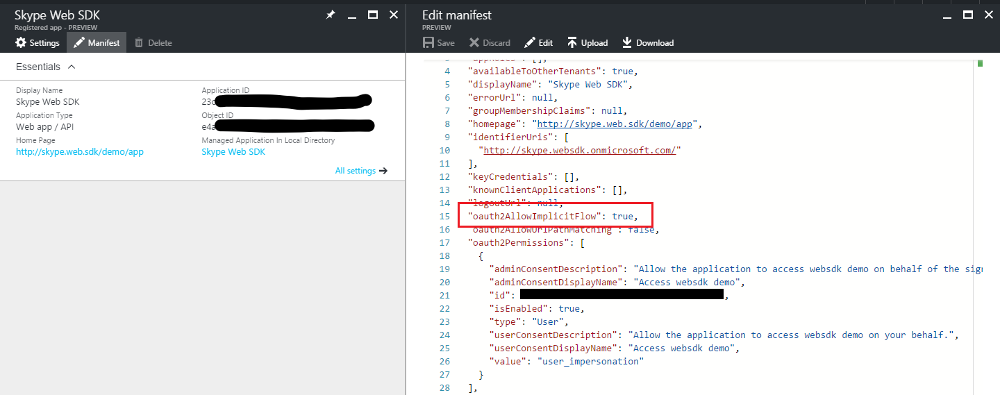

# AAD Auth Failures - Response type 'token' is not enabled for the application 

_**Applies to:** Skype for Business 2015_

## Who is this article for?

If you are attempting to use the Azure AD authentication option to sign into the Skype for Business Web SDK and you are seeing an AAD error page that looks like the following then this page is for you. The page should have this message: "response_type 'token' is not enabled for the application."

If this is not your issue, you can return to [this page](./AADAuthFailures.md) for a list of other potential issues.

## The Issue

When creating your app registration in AAD, you need to manually edit the application manifest and set the value of the `oauth2AllowImplicitFlow` property to `true`. Otherwise the AAD sign in flow will not work.

## The Solution

This issue has a straightforward solution.

1. Sign into **portal.azure.com** with an account that's an administrator in your tenant.
2. Navigate to Azure Active Directory in the left hand side bar.
3. Navigate to App registrations > your app
4. Click "Manifest" at the top of the pane describing your app.
5. Change the value of the property `oauth2AllowImplicitFlow` to `true`. If the property is not present, add it and set its value to `true`.

6. Save the modified manifest.

This should fix the issue.

## Related Topics

- [Troubleshooting AAD Auth Failures for Skype Web SDK](./AADAuthFailures.md)
- [Integrating Applications with Azure Active Directory](https://docs.microsoft.com/en-us/azure/active-directory/active-directory-integrating-applications)
