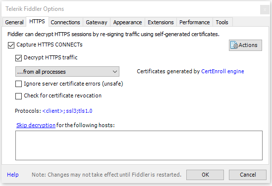

# Gathering Web Traffic Traces from the Skype Web SDK or Conversation Control

**In this article:**
- [Capturing Web Traffic with Fiddler](#fiddler)
- [Capturing Web Traffic with Charles](#charles)
- [Related Topics](#related-topics)

> [!WARNING] 
_**Do not post any web traffic traces** containing decrypted HTTPS traffic to **StackOverflow** or another public forum_. Doing so may expose your password or other private credentials to malicious agents.

Capturing the web traffic sent and received by your app can help make failures more obvious and easy to detect if your issue is due to a failing request to the server. This article provides instructions on how to use a web debugging proxy such as [Fiddler](http://www.telerik.com/fiddler) or [Charles](https://www.charlesproxy.com/) to capture a trace of your application's network activity. 

> [!NOTE] 
If you're submitting a web trace as part of an error report, submit the web trace as a **Fiddler** or **Charles** trace. Exceptions are only made when **Fiddler** and **Charles** aren't supported by the platform where your issue is occurring. 

## Capturing Web Traffic with Fiddler

Fiddler is fully supported on Windows machines and has begun beta support for OS X. Download Fiddler here: 

**[https://www.telerik.com/download/fiddler](https://www.telerik.com/download/fiddler)**

After the download completes, follow these steps to configure Fiddler to start capturing traffic from your web app:

1. Start Fiddler.
2. Select **Tools > Telerik Fiddler Options > HTTPS** and check the boxes marked **Capture HTTPS CONNECTs** and **Decrypt HTTPS Traffic** and ensure that the drop down reads **"...from all processes"** or **"...from browsers only"** depending on your scenario.
3. Accept any warning messages and restart Fiddler.
4. Reproduce the scenario.
5. Inspect the requests related to your web app, and pay special attention to requests with response statuses in the 400s and 500s (but note that some 401 responses are by design).
6. If you're capturing the web traffic to submit with an error report, or you'd like to revisit it later, go to **File > Save > All Sessions...**, select an appropriate save location, name the trace, and click **save**.

This is how the Fiddler options window should look if you've properly configured Fiddler to decrypt HTTPS traffic from your application:

## Capturing Web Traffic with Charles

Charles is supported on Windows, Mac OS, and Linux. You can download a previous release or a trial version of the latest release for free, but will have to pay if you wish to continue using the latest release when the trial expires. Download Charles here:

**[https://www.charlesproxy.com/download/latest-release/](https://www.charlesproxy.com/download/latest-release/)**

After the download completes, follow these steps to configure Charles to start capturing traffic from your web app:

1. Start Charles.
2. Charles is supposed to automatically start proxying all web traffic, so once you open a web browser and start navigating around you should see the traffic in Charles. However, if you don't see any traffic after navigating around, you can manually configure your computer send traffic through the Charles proxy. On a Windows machine, you can do this by going to **Network Proxy Settings > Manual proxy setup > Use a proxy server** and type **127.0.0.1** (localhost) in the Address field, and **8888** in the port field.
3. Follow the steps on [this site](https://www.charlesproxy.com/documentation/proxying/ssl-proxying/) to decrypt HTTPS traffic with Charles.
4. Reproduce the scenario.
5. Inspect the requests related to your web app, and pay special attention to requests with response statuses in the 400s and 500s (but note that some 401 responses are by design). 
6. If you're capturing the web traffic to submit with an error report, or you'd like to revisit it later, go to **File > Save Session**, select an appropriate save location, name the trace, and click **save**.

## Related topics
- [Proxy HTTPS Traffic with Fiddler](http://docs.telerik.com/fiddler/Configure-Fiddler/Tasks/DecryptHTTPS)
- [Enable SSL Proxying with Charles](https://www.charlesproxy.com/documentation/proxying/ssl-proxying/)
