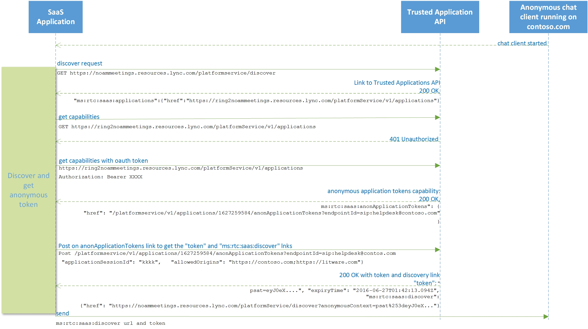
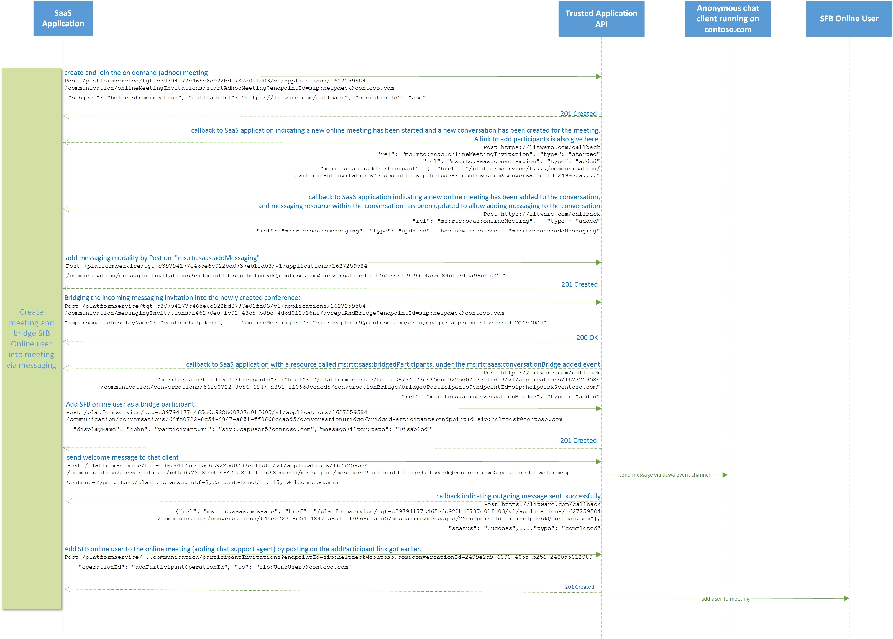

# Customer chat care call flow

This callflow consists of the following tasks:

- Discovery and getting anonymous application token
- Start an ad hoc meeting
- Bridge Skype for Business Online user into meeting via the messaging modality
- Agent joins meeting, sends messages, and leaves meeting


 
## Discovery and getting anonymous application token 

To start chat, the anonymous chat client pings the Service Application (SA), which further communicates with the Trusted Application API as follow: 

1. The Service Application (SA) discovers the location of the Trusted Application API (API)

    **a. Discovery Request**
    ```
    GET https://noammeetings.resources.lync.com/platformservice/discover
    ```
    **b. Discovery Response** -  Link to Trusted Applications API
    ```
    200 OK,"ms:rtc:saas:applications":{"href":"https://ring2noammeetings.resources.lync.com/platformService/v1/applications"}
    ```

2. The Service Application gets the capabilities
       
   **a. GET request with Trusted Applications API link** -
   We send GET request with Trusted Applications API link  received from the previous discovery Request. This GET request must be authenticated with a **valid OAuth token.**
    
    ```
    // A request without a valid OAuth token will return '401 Unauthorized response'.
    
    GET https://ring2noammeetings.resources.lync.com/platformService/v1/applications

    Response - 401 Unauthorized response
    ```
     
    **b. Capabilities GET Request with a valid OAuth token.**
    ```
    GET https://ring2noammeetings.resources.lync.com/platformService/v1/applications
    Authorization: Bearer XXXX
    ```
   **c. Capabilities Response** - Anonymous application tokens capability (ms:rtc:saas:anonApplicationTokens resource).

    ```
    200 OK,ms:rtc:saas:anonApplicationTokens": {
    "href": "/platformservice/v1/applications/1627259584/anonApplicationTokens?endpointId=sip:helpdesk@contoso.com" }
    ```
3. POST on anonApplicationTokens resource to get the token and a **[ms:rtc:saas:discover](http://trustedappapi.azurewebsites.net/Resources/ms_rtc_saas_discover.html)** link that can be shared with the anonymous chat client.

    **a. POST request on anonApplicationTokens resource**    
    ```
    Post /platformservice/v1/applications/1627259584/anonApplicationTokens?endpointId=sip:helpdesk@contos.com
    "applicationSessionId": "kkkk",   "allowedOrigins": "https://contoso.com;https://litware.com"}
    ```
    **b. Response**
    ```
    200 OK with token and discovery link
    "token": "
    psat=eyJ0eX....", "expiryTime": "2016-06-27T01:42:13.094Z",
    "ms:rtc:saas:discover": 
    {"href": "https://noammeetings.resources.lync.com/platformService/discover?anonymousContext=psat%253deyJ0eX..."}
    ```

    **c. Send ms:rtc:saas:discover url and token to the anonymous chat client**

    

## Start an ad hoc meeting   
    

4. The anonymous chat client uses the **[ms:rtc:saas:discover](http://trustedappapi.azurewebsites.net/Resources/ms_rtc_saas_discover.html)** link to get the anonApplications resource, which can be used to establish a ucwa session with the Trusted Application API
   
   **a. GET request on ms:rtc:saas:discover url to find "anonApplications" token**
   ```
   Get /platformservice/discover?anonymousContext=psat%253deyJ0e...
   Origin : http://contoso.com
   ```
   **b. Response - anonApplications resource**
   ```
   200 OK,anonApplications": {"href": "/ucwa/psanon/v1/applications"}
   ```
5. The chat client establishes a ucwa session with the API and uses the token from step 3, to authenticate itself.
    
    **a. Create Ucwa application at _anonApplications_ link with POST request**
    ```
    Post /ucwa/psanon/v1/applications
    "anonymousDisplayName": "Janardhan"}

    Response - 201 Created
    ```
6. The chat client sends a messaging invitation to the helpdesk uri: sip:helpdesk@contoso.com
    
    **a. POST request for chat support to helpdesk's sip uri. Custom content can be also be sent here.**
    ```
    POST /ucwa/psanon/v1/applications/101485875823/communication/messagingInvitations
    {"operationId":"ucwap2pimop","subject":"$(TrackableSubject)","to":"sip:helpdesk@contoso.com","customContent":"CID:2"}
    
    Response - 201 Created
    ```
7. The Trusted Application API sends a callback to the Service Application on receiving this messaging invitation, along with the two links: **[ms:rtc:saas:startAdhocMeeting](http://trustedappapi.azurewebsites.net/Resources/ms_rtc_saas_startAdhocMeeting.html)** and **[ms:rtc:saas:acceptAndBridge](http://trustedappapi.azurewebsites.net/Resources/ms_rtc_saas_acceptAndBridge.html)**.

    **a. Callback to Service Application** - It indicates that a **[ms:rtc:saas:messagingInvitation](http://trustedappapi.azurewebsites.net/Resources/ms_rtc_saas_messagingInvitation.html)** was started. It has the options to start an on-demand meeting and a way to bridge the messaging invitation with the on-demand meeting.
    This also includes the custom content sent from the chat client.
    ```
    POST https://litware.com/callback
    "rel": "ms:rtc:saas:messagingInvitation"  "type": "started"     
    "ms:rtc:saas:startAdhocMeeting": {"href": "/platformservice/tgt-c39794177c465e6c922bd0737e01fd03/v1/applications/1627259584
    /communication/onlineMeetingInvitations/startAdhocMeeting?endpointId=sip:helpdesk@contoso.com"}
    "ms:rtc:saas:acceptAndBridge": {"href": "/platformservice/tgt-c39794177c465e6c922bd0737e01fd03/v1/applications/1627259584
    /communication/messagingInvitations/b46270e0-fc92-43c5-b89c-4d6d0f2a16af/acceptAndBridge?endpointId=sip:helpdesk@contoso.com"} 
    "customContent": "href": "data:foo/foo,ThisIsARandomCustomContent"                              
    ```
   

## Bridge Skype for Business Online user into meeting via the messaging modality

8. The Service Application(SA) sees that it has received a support request and spins up an on-demand meeting, using the link in the resource **[ms:rtc:saas:startAdhocMeeting](http://trustedappapi.azurewebsites.net/Resources/ms_rtc_saas_startAdhocMeeting.html)**. 
    **a. Create and join the on-demand (adhoc) meeting**
    ```
    Post /platformservice/tgt-c39794177c465e6c922bd0737e01fd03/v1/applications/1627259584
    /communication/onlineMeetingInvitations/startAdhocMeeting?endpointId=sip:helpdesk@contoso.com
    "subject": "helpcustomermeeting", "callbackUrl": "https://litware.com/callback", "operationId": "abc"
    
    Response - 201 Created
    ```
9. The Service Application receives a callback event with conversation state as conferenced, along with an **[ms:rtc:saas:addParticipant](http://trustedappapi.azurewebsites.net/Resources/ms_rtc_saas_addParticipant.html)** link. This link is used to add participants to the meeting.
    
    **a. Callback to SaaS application** - It indicates that a new online meeting has been started and a new conversation has been created for the meeting.
    A link to add participants is also give here.
    ```
    Post https://litware.com/callback
    "rel": "ms:rtc:saas:onlineMeetingInvitation", "type": "started"
    "rel": "ms:rtc:saas:conversation", "type": "added"
    "ms:rtc:saas:addParticipant": {  "href": "/platformservice/t..../communication/participantInvitations?endpointId=sip:helpdesk@contoso.com&conversationId=2499e2a...."
    ```
10. The Service Application receives other callback event indicating that a new online meeting has been added to the conversation, 
    and messaging resource within the conversation has been updated to allow adding messaging to the conversation. 
    ```
    Post https://litware.com/callback
    "rel": "ms:rtc:saas:onlineMeeting",   "type": "added"
    "rel": "ms:rtc:saas:messaging", "type": "updated" - has new resource - "ms:rtc:saas:addMessaging"
    ```

11. The Service Application then adds messaging modality by Post on  "ms:rtc:saas:addMessaging"
    ```
    Post /platformservice/tgt-c39794177c465e6c922bd0737e01fd03/v1/applications/1627259584
    /communication/messagingInvitations?endpointId=sip:helpdesk@contoso.com&conversationId=1765e9ed-9199-4566-84df-9faa99c4a023"
    
    Response - 201 Created
    ```
12. The Service Application then uses the **[ms:rtc:saas:acceptAndBridge](http://trustedappapi.azurewebsites.net/Resources/ms_rtc_saas_acceptAndBridge.html)** capability to bridge the incoming messaging invitation into the on demand meeting that it just created.
    
    **a. Bridging the incoming messaging invitation into the newly created conference**
    ```
    Post /platformservice/tgt-c39794177c465e6c922bd0737e01fd03/v1/applications/1627259584
    /communication/messagingInvitations/b46270e0-fc92-43c5-b89c-4d6d0f2a16af/acceptAndBridge?endpointId=sip:helpdesk@contoso.com
    "impersonatedDisplayName": "contosohelpdesk",     "onlineMeetingUri": "sip:UcapUser9@contoso.com;gruu;opaque=app:conf:focus:id:2Q4970OJ"
    
    Response - 200 OK
    ```
13. The Service Application receives a callback : **[ms:rtc:saas:conversationBridge](http://trustedappapi.azurewebsites.net/Resources/ms_rtc_saas_conversationBridge.html)** added event, meaning a new conversation bridge has been created. Calling a GET on this resource shows you another resource, which can be used to get or add bridge participants :**[ms:rtc:saas:bridgedParticipants](http://trustedappapi.azurewebsites.net/Resources/ms_rtc_saas_bridgedParticipants.html)**.
    ```
    Post https://litware.com/callback
    "ms:rtc:saas:bridgedParticipants": {"href": "/platformservice/tgt-c39794177c465e6c922bd0737e01fd03/v1/applications/1627259584
    /communication/conversations/64fe0722-8c54-4847-a851-ff0668ceaed5/conversationBridge/bridgedParticipants?endpointId=sip:helpdesk@contoso.com"
    "rel": "ms:rtc:saas:conversationBridge", "type": "added"
    ```

14. The Service Application sends POST request on the **[ms:rtc:saas:bridgedParticipants](http://trustedappapi.azurewebsites.net/Resources/ms_rtc_saas_bridgedParticipants.html)** link to add the SFB online users who are handling the chat support requests to the conversation bridge. This request includes a messageFilterState parameter set to disabled. If enabled, it means that the messages sent by the participant are not sent to the chat client, and vice versa. This request also has displayName and participantUri parameters to set the display name and indicate the sip uri of the SFB online user to add.
    
    **a.  Add SFB online user as a bridge participant**
    ```
    Post /platformservice/tgt-c39794177c465e6c922bd0737e01fd03/v1/applications/1627259584
    /communication/conversations/64fe0722-8c54-4847-a851-ff0668ceaed5/conversationBridge/bridgedParticipants?endpointId=sip:helpdesk@contoso.com
    "displayName": "john", "participantUri": "sip:UcapUser5@contoso.com","messageFilterState": "Disabled"
    ```
15. The Service Application does a POST on the **[ms:rtc:saas:sendMessage](http://trustedappapi.azurewebsites.net/Resources/ms_rtc_saas_sendMessage.html)** token link with a welcome text and gets callbacks informing that the message has been successfully sent.
    
    **a.  Send welcome message to chat client**
    ```
    Post /platformservice/tgt-c39794177c465e6c922bd0737e01fd03/v1/applications/1627259584
    /communication/conversations/64fe0722-8c54-4847-a851-ff0668ceaed5/messaging/messages?endpointId=sip:helpdesk@contoso.com&operationId=welcomeop
    Content-Type : text/plain; charset=utf-8,Content-Length : 15, Welcomecustomer
    ```
    **b.  The chat client receives the message in its event channel**
   
    **c. Callback indicating that the outgoing message was sent  successfully**
    ```
    Post https://litware.com/callback
    {"rel": "ms:rtc:saas:message", "href": "/platformservice/tgt-c39794177c465e6c922bd0737e01fd03/v1/applications/1627259584
    /communication/conversations/64fe0722-8c54-4847-a851-ff0668ceaed5/messaging/messages/2?endpointId=sip:helpdesk@contoso.com"},
    "status": "Success",...."type": "completed"
    ```

16. The Service Application then proceeds to add one or more participants to the meeting, using POST on the link of the resource : **[ms:rtc:saas:addParticipant](http://trustedappapi.azurewebsites.net/Resources/ms_rtc_saas_addParticipant.html)**, got in step 9. These participants are the customer service representatives that will answer the chat support request, and are SFB online users.
    
    ```
    Post /platformservice/...communication/participantInvitations?endpointId=sip:helpdesk@contoso.com&conversationId=2499e2a9-6090-4055-b256-2480a5012989
    "operationId": "addParticipantOperationId", "to": "sip:UcapUser5@contoso.com"
    ```

    **b. Trusted Application API sends join meeting request to the participant**

   


## Agent joins meeting, sends messages, and leaves meeting 

17. The Service Application gets a callback when the SFB Online user joined the IM meeting.
    
    **a. Participant accepts the meeting request**
    
    **b. Callback to the Service Application** - indicating that the participant was added to the meeting
    
     ```
    Post https://litware.com/callback
    "rel": "ms:rtc:saas:participant", "href": "/platformservice/tgt-.../v1/applications/1627259584
    /communication/conversations/2499e2a9-.../participants/ucapuser5@contoso.com?endpointId=sip:helpdesk@contoso.com",
    "title": "UcapUser5"...  "type": "added"

     ```

18. If the SFB Online user is sending an "Is Typing" notification, it will be conveyed to the chat client on its event channel
19. SFB online user sends a message, it will be conveyed to the chat client on its event channel
20. The chat client sends an IsTyping notification, it will be conveyed to all the SFB online users joined to the conference.
21. The chat client sends a message, it will be conveyed to all the SFB online users joined to the conference.
22. The chat client now closes the conversation
23. API sends a callback to the SA, indicating the conversation has been deleted.
24. The Service Application then sends a request to terminate the conference conversation with the Trusted Application API
   
   
 
The way the API informs the Service Application of any event is via the callback url. In order for the Service Application to keep context when starting a new invitation or message, an operation id can be passed in. This id will be sent back in the callback event.
 
The general principles, capabilities, API style, API concepts are modeled to closely follow the already released UCWA API. Please see this link for detailed info - [UCWA API reference](https://msdn.microsoft.com/en-us/skype/ucwa/ucwa2_0apireference)
 
Being familiar with the UCWA concepts greatly simplifies understanding the Trusted Application APIs
 
 
The detailed call flow is shown in the diagram below. Each of the capability related APIs, related callbacks are modeled on the UCWA capabilities and callback structure. Please refer to the [UCWA API reference](https://msdn.microsoft.com/en-us/skype/ucwa/ucwa2_0apireference) to get detailed description
about these  calls.

## Next step
The callflow describes the customer care chat scenario from the perspective of a service application. To see how client side logic is implemented, get the [Web SDK chat sample](https://github.com/OfficeDev/skype-docs/tree/master/Skype/WebSDK/samples/Chat) or review the following topic.
- [Implementing a Chat Client with the Skype Web SDK](ImplementingChatClientWithSkypeWebSDK.md)

