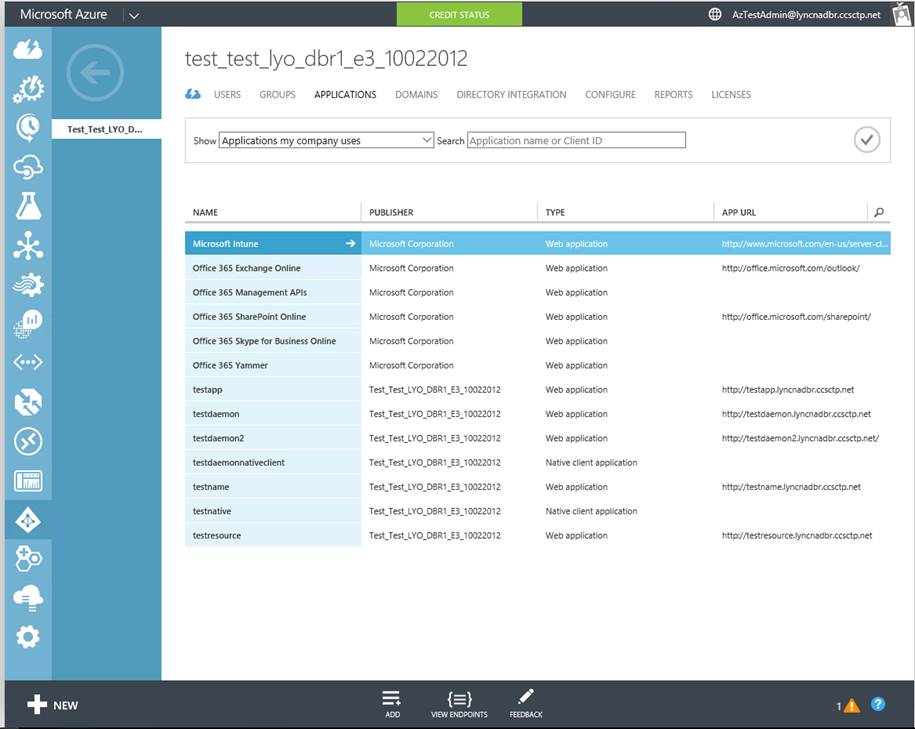
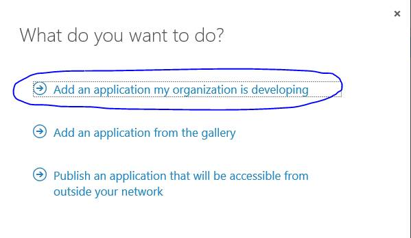
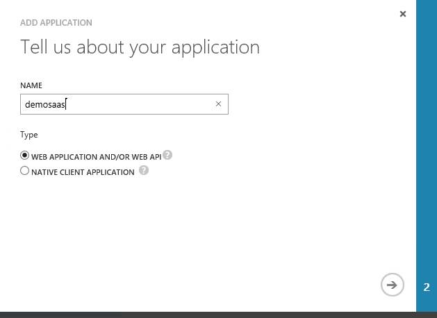
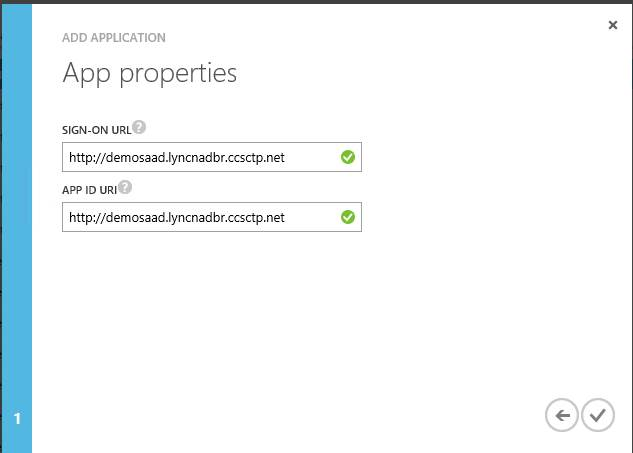
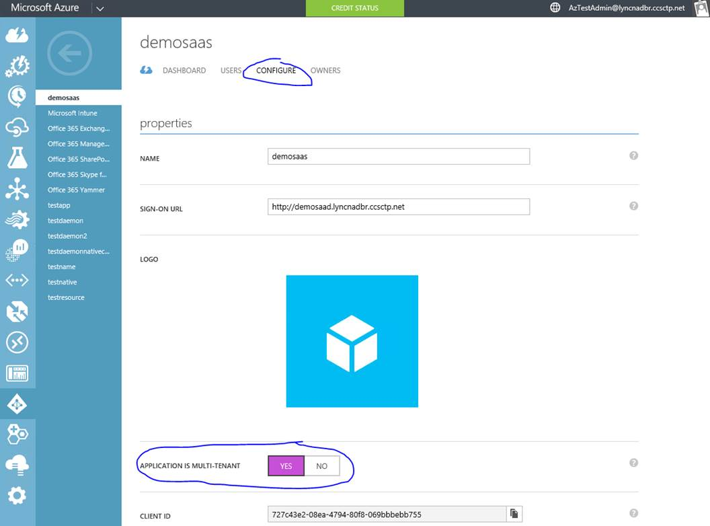
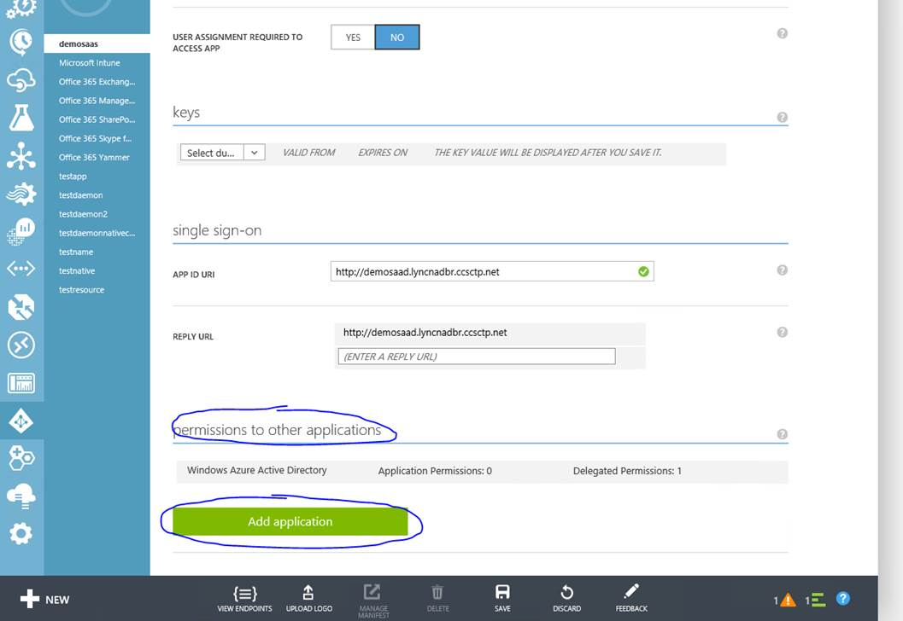
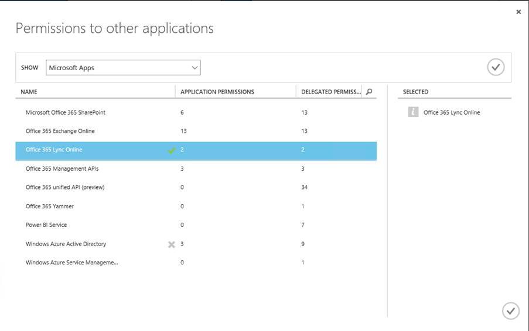

# Registering your application in Azure AD
This article shows you how to register your service application in the classic Azure Management Portal for Azure Active Directory. Before running your service application, you need to register it with Azure AD. Application registration lets you set the permissions that 
your service applications needs and the sign on and application id URLs used for application authentication.

## Register your application with Azure AD

Sign in to the Classic Azure Management Portal, then do the following:

1. Click the **Active Directory** node in the left column and select the directory linked to your Skype for Business subscription.
 
2. Select the **Applications** tab and then **Add** at the bottom of the screen.

 

3. Select **Add an application my organization is developing**.

 

4. Choose a name for your application, such as `demosaas`, and select **Web application and/or web API** as its **Type**. Click the arrow to continue.

 

5. The value of **Sign-on URL** is the URL at which your application is hosted.
 
6. The value of **App ID URI** is a unique identifier for Azure AD to identify your application. You can use `http://{your_subdomain}/skypewebsample`, where `{your_subdomain}` is the subdomain of .onmicrosoft you specified while signing up for your Skype for Business Web App (website) on Azure. Click the check mark to provision your application. 
  

7. Select the **Configure** tab, scroll down to the **Permissions** to other applications section, and click the **Add application** button. 
 
  
 
  
 
  
 
  If using the new azure portal select API Access -> **Required Permissions** and **Select an API**
  
 
8. Go to Application Permissions -> Select Application Roles: for accessing Skype for Business Online on behalf of an application
 
   
  
9. Go to Delegated Permissions - > Select User scopes: for accessing Skype for Business Online through this application as a user
 
  
 
If the permissions for Skype for Business do not show in the Azure Management Portal, one likely cause is that the Office 365 account is not associated with the Azure AD.

## Additional information

- [Application and service principal objects in Azure Active Directory](https://azure.microsoft.com/en-us/documentation/articles/active-directory-application-objects/)
- [Associate an Office 365 tenant with an Azure subscription](https://docs.microsoft.com/en-us/azure/billing-add-office-365-tenant-to-azure-subscription) 