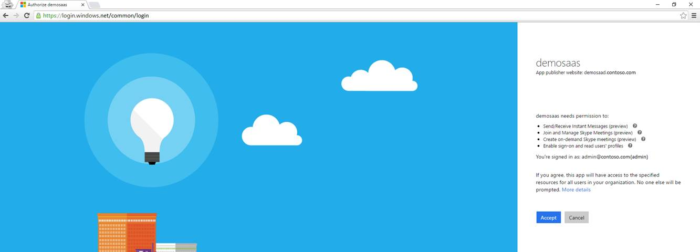

# Tenant Admin Consent

 
When the application is registered in AAD, it is registered in the context of a tenant. When the same tenant wants to use the application, you do not need tenant consent.
 
For a different tenant to use the Service Application, for example, when the application is developed as a multi-tenant application, it must be consented to by that tenant's admin.
 
In order for a tenant to consent to the application, the following is required:
 
1. Construct a consent link with the client id and redirect uri of the Service Application set correctly
 
 ```https
 https://login.windows.net/common/oauth2/authorize?response_type=id_token&client_id=727c43e2-08ea-4794-80f8-069bbbebb755&redirect_uri=http://trusteddemo.contoso.com&response_mode=form_post&nonce=a4014117-28aa-47ec-abfb-f377be1d3cf5&resource=https://noammeetings.resources.lync.com&prompt=admin_consent
``` 
This opens up a page after the tenant admin logs in. It lists the permissions the Service Application has asked for the tenant admin to consent. Once accepted the Service Application can get oauth tokens from AAD, for that tenant.
 
Read more about [Building service apps in Office 365](https://msdn.microsoft.com/en-us/office/office365/howto/building-service-apps-in-office-365)

 

 
## Revoking tenant admin consent:
 
Consent to service applications can be revoked just like for other applications that are installed by a tenant administrator of the Office 365 organization. The administrator can either go to the AAD Azure Management Portal, find the application in the application view, select and delete it, or alternatively the administrator can use Azure AD PowerShell to remove the app via the "Remove-MSOLServicePrincipal" cmdlet.
 

```PowerShell 
PS C:\windows\system32> Get-MsolServicePrincipal
 
    ExtensionData         : System.Runtime.Serialization.ExtensionDataObject
    AccountEnabled        : True
    Addresses             : {Microsoft.Online.Administration.RedirectUri}
    AppPrincipalId        : 727c43e2-08ea-4794-80f8-069bbbebb755
    DisplayName           : demosaas
    ObjectId              : 6291d162-f57f-44f8-8022-d8e17cbca62a
    ServicePrincipalNames : {http://demosaad.contoso.com, 727c43e2-08ea-4794-80f8-069bbbebb755}
    TrustedForDelegation  : False

 Remove-MsolServicePrincipal -ObjectId 6291d162-f57f-44f8-8022-d8e17cbca62a
 
```  