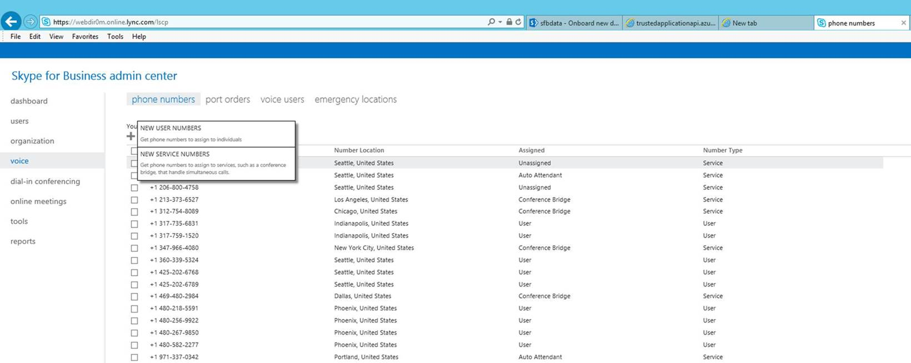

# Set up a Trusted Application Endpoint 

Tenant Admin Provisioning includes setting up the trusted endpoints and tenant admin consent.
Please refer [Tenant Admin Consent](./TenantAdminConsent.md) for a tenant to consent to the application.

You can easily register **Trusted Application Endpoints** by using the PowerShell cmdlets.
More information about PowerShell cmdlets usage can be found in [Using Windows PowerShell to manage Skype for Business Online](https://technet.microsoft.com/en-us/library/dn362831.aspx).

## Managing Trusted Application Endpoint With PowerShell


>Note: For PSTN, you will need to follow step 1 and 2 to acquire service number that will be assigned to Trusted Application Endpoint. **For Service application or Chat customer care application, 
step 1 and 2  are not necessary, and you should skip to step 3**.

 1. For PSTN, You are required to have an **E5 license** 
to enable PSTN calling with the Trusted Application API. To enable PSTN calling, the Skype for Business Domestic and International Calling feature must be active. Please refer to [products.microsoft.com](https://products.office.com/en-us/business/office-365-enterprise-e5-business-software)  for more details.

 2. For PSTN, Acquire the **service numbers** to assign to the trusted application endpoint. Please refer to [support.office.com](https://support.office.com/en-us/article/Getting-Skype-for-Business-service-phone-numbers-e434aeb2-af99-40e7-981e-a474f0383734) for more details. 
 
   

 3. Following [Skype for Business PowerShell cmdlets](https://technet.microsoft.com/en-us/library/dn362831.aspx)
 can be used to setup trusted application endpoints.

 >Note: For PSTN, Assign the **service numbers** to the trusted application endpoint using _New-CsOnlineApplicationEndpoint PhoneNumber_ parameter. PhoneNumber is not required for Service or Chat customer care application.


- **New-CsOnlineApplicationEndpoint** - It creates a new application endpoint.


| | Parameters     | Required | Type   | Description                                       |
|-| ---------------|:---------|:------:| -------------------------------------------------:|
| | Name           | Required | String | Friendly name for Application endpoint.            |
| | ApplicationId  | Required | Guid   | Unique application Id that this endpoint will use. |
| | Uri            | Required | String |    The SipUri for the Endpoint. |
| | CallbackUri    | Required | String |    The Callback Uri.             |
| | PhoneNumber    | Optional | String |    Phone number for the endpoint.    |

 
- **Get-CsOnlineApplicationEndpoint** - It is used to fetch the application endpoints for the tenants.

| | Parameters     | Required | Type   | Description                                       |
|-| ---------------|:---------|:------:| -------------------------------------------------:|
| | Uri           | Required | String | The SipUri for the Endpoint.        |

- **Set-CsOnlineApplicationEndpoint** - It is used to update the application endpoint.

| | Parameters     | Required | Type   | Description                                       |
|-| ---------------|:---------|:------:| -------------------------------------------------:|
| | Uri            | Required | String | The SipUri for the Endpoint.        |
| | CallbackUri    | Optional | String | The Callback Uri.         |
| | PhoneNumber    | Optional | String |    Phone number for the endpoint.    |

- **Remove-CsOnlineApplicationEndpoint** - It is used to remove the application endpoint.

| | Parameters     | Required | Type   | Description                                       |
|-| ---------------|:---------|:------:| -------------------------------------------------:|
| | Uri            | Required | String | The SipUri for the Endpoint.        |

 
### Example

The following PowerShell cmdlet creates a new application endpoint.

```PowerShell
New-CsOnlineApplicationEndpoint -Uri "sip:sample@domain.com" -ApplicationId "44ff763b-5d1f-40ab-95bf-f31kc8757998" -CallbackUri "https://sampleapp/callback" -Name "SampleApp" -PhoneNumber "19841110909"
```

